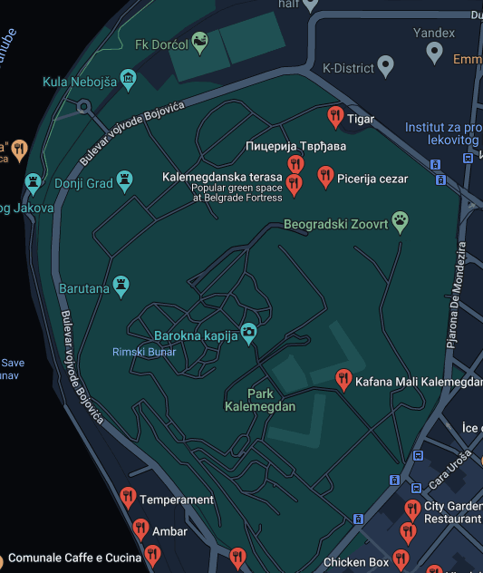

# Write-Up
> **title:** A table
>
> **category:** Osint
>
> **difficulty:** Moyen 
>
> **point:** 50
>
> **author:** L'exploratrice
>
> **description:**
>Un cousin à moi à mangé dans un restaurant dans la capitale du pays du challenge "Panneau" le 18/11/2022 non loin de bêtes peu communes.
 Vous pouvez me dire ce qu'il a préféré ?

## Analyse du sujet
Le pays trouvé lors du challenge "Panneau" est la serbie. La capitale est donc **Belgrade**.
 Ici, le bout de phrase important à souligner est "non loin de bêtes peu communes". Où trouver des bêtes peu communes en pleine ville ? Eh bien, assez rapidement, nous pouvons penser à un **zoo**. 
A partir de ce postulat, il nous faut lister les restaurants aux alentours d'un zoo à Belgrade.  
Nous tombons sur la zone suivante, dans laquelle se trouvent 4 restaurants : 

 
Maintenant, nous pouvons analyser les google avis afin d'extraire un avis pouvant piquer notre intérêt, parlant d'un plat. Néanmoins, nulle peine d'examiner l'entièreté des avis, sachant que la eprsonne y a mangé le 18/11/2022, il y a donc **3 semaines**. Nous devons donc analyser les avis datant d'il y a 3 semaines.
 
Lorsque l'on regarde les avis du restaurant **Kalemegdanska terasa** on remarque qu'un avis d'il y a trois semaine ressort, posté par un certain <i>Nicolas Coulmeau</i> et disant la chose suivante: **It was good but Gibanica was way better (gg)**  le "gg" faisant référence à la réussite de l'épreuve :)
  
Le flag est donc : **CYBN{gibanica}**

