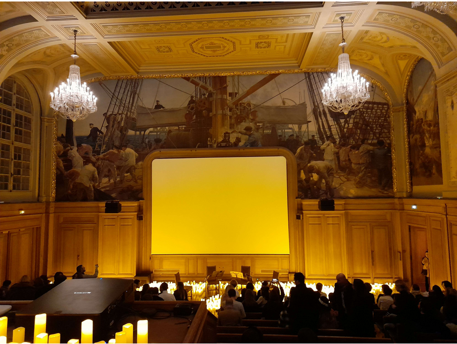
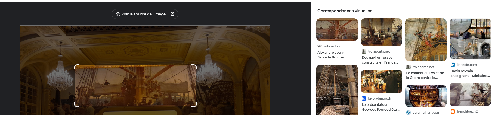
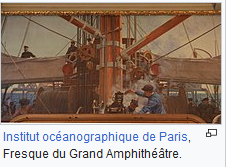
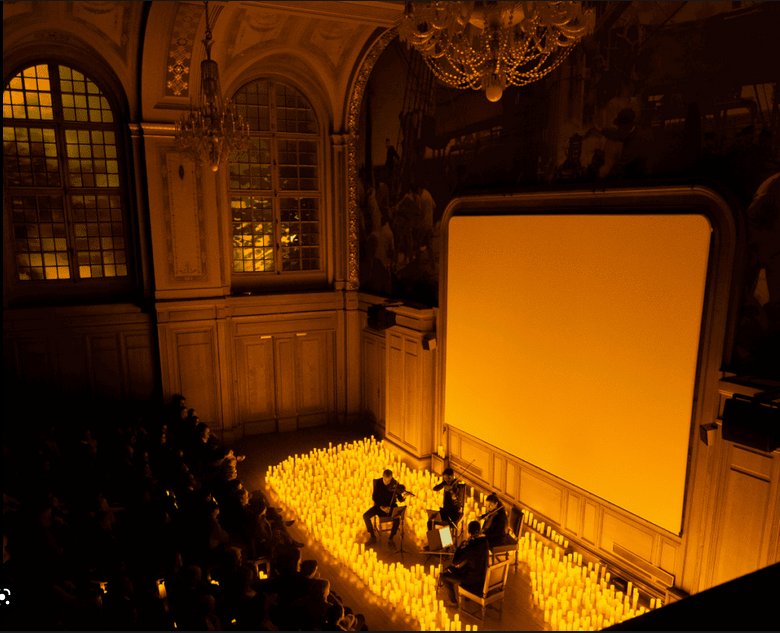

# Write-Up
> **title:** Concerto
>
> **category:** Osint
>
> **difficulty:** Difficile 
>
> **point:** 100
>
> **author:** Maestran
>
> **description:**
>
> Je te laisse, le concert va bientôt commencer ! J'espère que quelqu'un l'enregistre.  
Mais d'ailleurs, où a eu lieu ce concert ? Quel est le nom de cet évenement ? Et à quel groupe / artiste ce concert rend hommage ?

## Analyse de l'image

En passant l'image globale sur google images afin d'effectuer une recherche-inversée, les résultats trouvés ne semblent pas donner quelque chose de probant.
Néanmoins, plusieurs éléments sont à prendre en compte au sein de la photo. Nous voyons qu'un concert est effectué, entouré de bougies. De plus, une large peinture murale trône face au publique. 
 Notre recherche inversée peut donc se concentrer sur cette peinture murale, qui pourrait nous renseigner sur l'auteur : 

On trouve que l'auteur de cette peinture est **Alexandre Jean-Baptiste Brun**. En analysant ses oeuvres, nous trouvons assez rapidement que celle nous intéressant porte le nom de "Fresque du Grand Amphithéâtre" et est affichée à <i>l'Institut océanographie de Paris</i>.  

En effectuant une recherche google **Institut océanographique de Paris concert**, nous tombons sur la salle de concert, dont le nom de l'évènement : **Candlelight**   

Il ne nous reste plus qu'à trouver le nom du groupe/artiste auquel ce concert rend hommage. Rien de plus simple, rendons nous sur le site de l'institut océanographique de Paris (portant le nom de **maison de l'océan**) et cherchons les concerts hommages les plus proche ("le concert va BIENTÔT commencer") en tapant "candlelight concert hommage institut océanographique de Paris"  
On tombe sur un évènement Candlelight Hommage à Queen, à dater du 22 décembre 2022.

Le flag est donc le suivant : **CYBN{MAISONDELOCEAN_CANDLELIGHT_QUEEN}**
