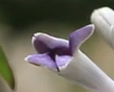
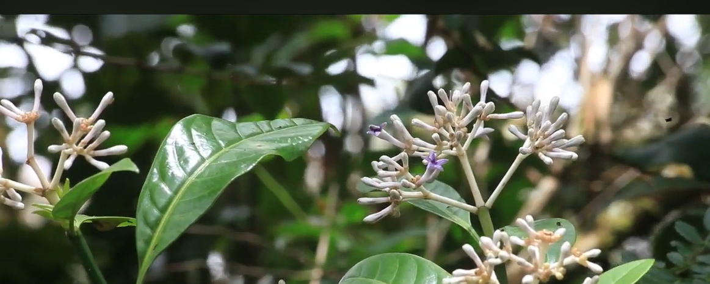

# Write-Up
> **title:** Gimme_the_plant
>
> **category:** Osint
>
> **difficulty:** Difficile 
>
> **point:** 100
>
> **author:** Lmeaou
>
> **description:**
>
> J'ai cette image qui vient d'un reportage d'un ami, apparement y'a une histoire de corail à la réunion. Il a fait une video dessus, vous pouvez me donner la date de mise en ligne de la video et le nom de sa société de prod' ?

## Analyse de l'image
Lorsque l'on obtient une image en Osint, le premier réflexe qui me vient à l'esprit est d'utiliser google lens afin de pouvoir faire une recherche-inversée à partir de l'image.

En regardant l'image de plus près, on se rend compte qu'elle est très petite, et en zoomant nous nous rendons compte qu'elle est floue.

De ce fait, l'utilisation de google lens nous donnera des résultats très peu fructeux.

Revenant sur le sujet, plusieurs mots sont à relever : "reportage", "plant", "la réunion", "histoire de corail", "video".
 Sans trop d'étonnement, la photo provient d'un arrêt sur image d'une vidéo. Il serait temps de trouver celle-ci. 
Pour ce faire, nous pouvons nous rendre sur youtube et entrer les mots clés que l'on a relevé : **reunion corail plant**

On tombe sur une vidéo disponible à [cette adresse](https://www.youtube.com/watch?v=1v4h0ZL_kTk&t=31s&ab_channel=ParcnationaldeLaR%C3%A9union)

La prise d'image s'est faite aux alentours de 31 secondes, à partir de l'image suivante : 

On regarde la description de la vidéo, publiée le 7 février 2019, et l'on trouve la société de production : Catwell.

Le flag est donc : **CYBN{07/02/2019_catwell}**