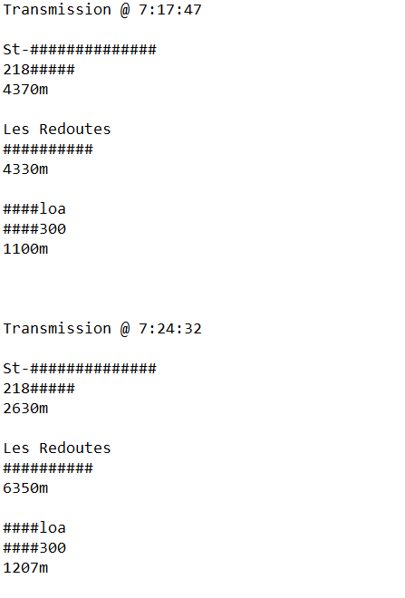
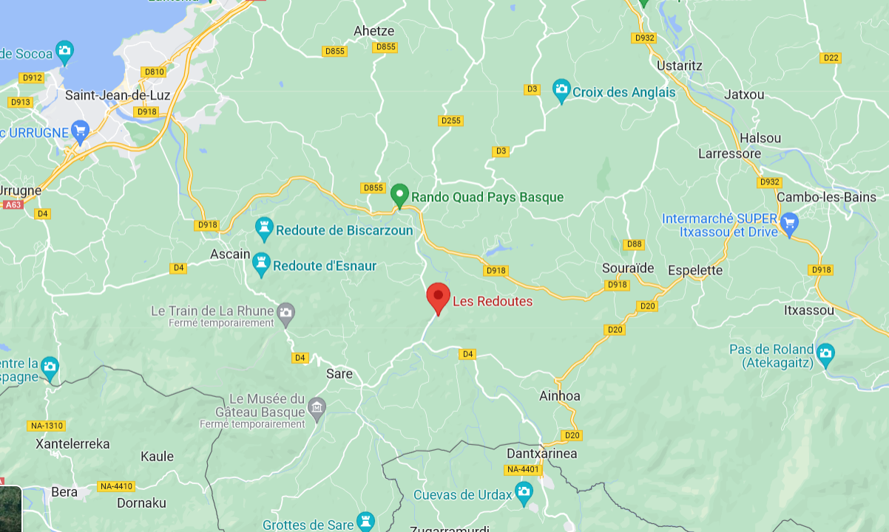
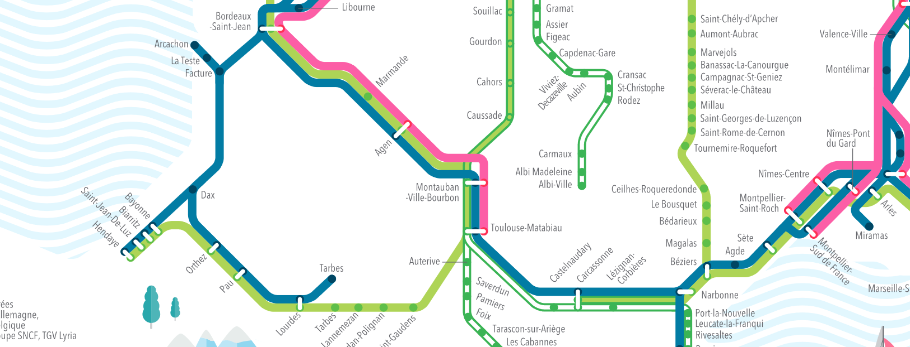
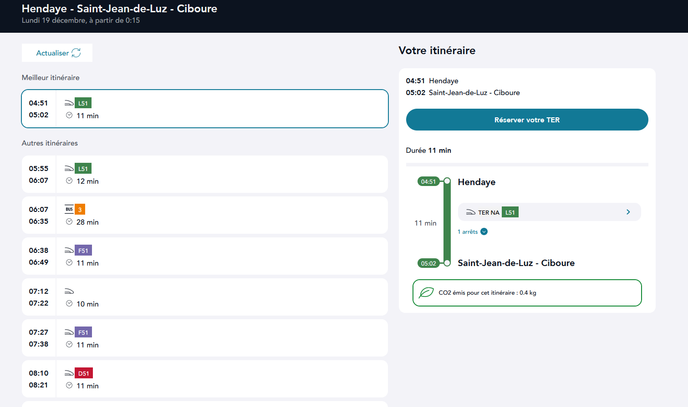
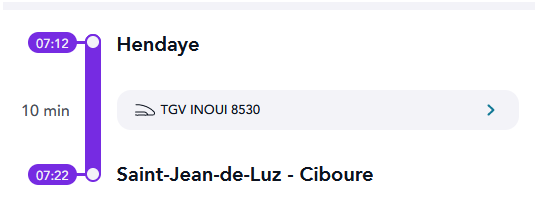

# Write-Up
> **title:** Deviens champion sers toi de tout ce que tu as appris
>
> **category:** Osint
>
> **difficulty:** Difficile
>
> **point:** 100
>
> **author:** ?
>
> **description:**
> Un TGV est parti aujourd'hui. De quelque part. Vous voulez bien me dire d'où, et le numero du TGV ?

## Analyse du sujet
Lors de l'ouverture du sujet, nous pouvons remarquer la présence d'un fichier texte nommé "transmission-record.txt".
Comme son nom l'indique, nous pouvons nous attendre à obtenir des transmissions de train. Nous obtenons les résultats suivant :  

Un endroit ressort de ce fichier texte : les redoutes. Lors d'une rapide recherche sur internet, nous apprenons que c'est un chemin de randonnée situé à Saint-Pée-sur-Nivelle.  
En plaçant les Redoutes sur la carte, nous pouvons faire un tour des horizons afin de repérer les grandes villes présentes aux alentours, en l'occurrence <strong>Saint-Jean-de-Luz</strong> :   

La découverte de Saint-Jean-de-Luz coïncide avec la ligne "St-##############". Nous savons également que notre train est un tgv, il nous faut alors découvrir les lignes tgv passant dans cette zone.   

Nous voyons qu'une ligne de tgv passe à Saint-Jean-De-Luz, en partance de la ville d'Hendaye. Au vu de notre fichier de transmission, 2 transmissions sont réalisées : une à 7:17:47 et une à 7:24:32. Concernant la première, la distance à Saint-Jean-De-Luz est de 4370m et la deuxième est à 2630m ce qui prouve que le train s'approche de Saint-Jean-De-Luz. En regardant les trains en partance d'Hendaye, et passant par Saint-Jean-De-Luz, nous obtenons les horaires suivants :   

On remarque aisément un train à destination de saint-jean-de-luz arrivant à 7h22, en partance d'Hendaye, via le tgv numéro 8530.   
   
Cet horaire entre dans notre fenêtre de tir **[7h17-7h24]**. Mon hypothèse est que le train est arrivé en avance à Saint-Jean-de-Luz et est parti à 7h22, a fait environ 2km avant 7h24 et 32 secondes. 

Le flag est donc : **CYBN{hendaye_8530}**
