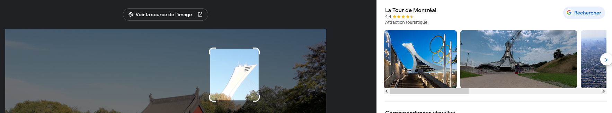

# Write-Up
> **title:** Wisdom
>
> **category:** Osint
>
> **difficulty:** Facile 
>
> **point:** 25
>
> **author:** Maestran
>
> **description:**
>
> "When anger rises, think of the consequences."  Le flag est le numero de rue du batiment en arrière plan
## Analyse de l'image
Soit nous ne sommes jamais allé à cette endroit (vive Montréal :) et nous utilisons google lens pour une recherche inversée, soit nous y sommes déjà allés et donc cela tombe sous le sens que nous sommes près du biodôme (dont on voit la structure en arrière plan)

 Il est donc question de La Tour de Montréal, atttachée au stade olympique de Montréal, collée au Bodôme de Montréal qui se situe au **4777 avenue Pierre-De Coubertin**

le flag est donc **CYBN{4777}**