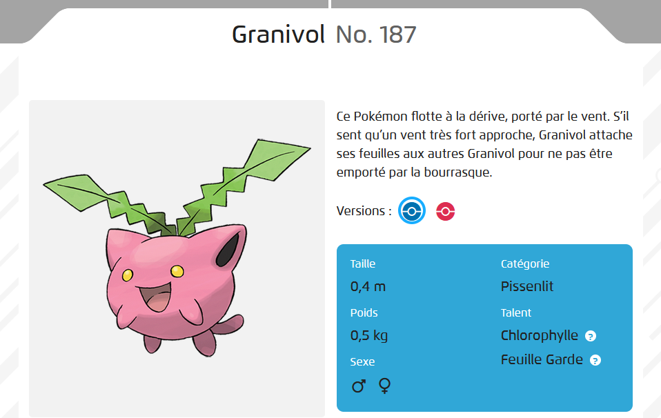
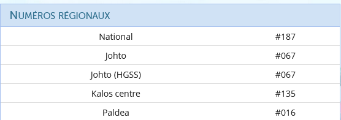
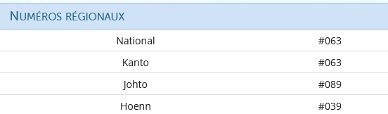

# Write-Up
> **title:** Deviens champion sers toi de tout ce que tu as appris
>
> **category:** Steganographie
>
> **difficulty:** Moyen
>
> **point:** 50
>
> **author:** Lmeaou
>
> **description:**
>
> hey, vous connaissez chat GPT, le site ou on peut discuter avec une IA ? je lui ai fait écrire ce petit dialogue tout à l’heure, c’est sympa non ?   Salut, j’ai vu un granivol tout à l’heure dans le jardin. Moi, j’ai vu un abra près du parc. Ah oui ? J’ai aussi vu un empiflor dans les bois. Cool ! Et moi, j’ai rencontré une Poissirène au bord de l’étang. Waouh, c’est génial ! Moi, j’ai croisé un Snubull sur le chemin du retour. Impressionnant ! J’ai aussi vu un Héliatronc voler au-dessus des arbres. C’est vraiment fascinant ! Et toi, tu as vu quelque chose d’intéressant ? Oui, j’ai vu une Sabelette courir dans l’herbe. Et moi, j’ai vu deux Tadmorvs se pourchasser dans les hautes herbes. C’est rigolo ! J’ai aussi vu un Insolourdo près de la rivière. Moi, j’ai vu une Nidoran♀ dans les buissons. Ah oui ? J’ai vu un Nidorino à l’orée de la forêt. Oui, c’est vraiment cool ! Et toi, tu as vu quoi d’autre ? J’ai vu un autre Insolourdo et un Tadmorv se battre. Intéressant ! Moi, j’ai vu un Nidorino qui chassait une Noeunoeuf, il était aidé par une Nidoran♀. Oh oui, c’était fascinant ! Et toi, tu as vu quelque chose d’intéressant ? Oui, j’ai vu un Arbok se faufiler dans les buissons. Ah oui ? Moi, j’ai vu un Aéromite voler au-dessus des arbres. C’est génial ! Et toi, tu as vu quelque chose d’intéressant ? Oui, j’ai vu une Nidoran♀ se cacher dans les fougères. Ah oui, c’est intéressant ! Et moi, j’ai vu un Insolourdo se reposer sous un arbre. Cool ! Et moi, j’ai vu deux Mimitoss sauter dans les hautes herbes. Oui, c’était vraiment sympa ! Et toi, tu as vu quoi d’autre ? J’ai vu un Goupix se faufiler dans les broussailles. Ah oui, c’est super ! On a vu plein d’espèces intéressantes aujourd’hui.

## Analyse du sujet
En lisant le texte, nous nous rendons compte que nous avons de nombreux noms de pokemon, pouvant nous faire penser à l'utilisation d'un code. Lorsque nous recherchons "steganographie pokemon" , nous tombons sur une page d'un forum rootme dans lequel un utilisateur spécifie que le numéro du pokemon dans le pokedex peut faire référence au code ascii... intéressant, non? 
La première chose à faire est donc de répertorier l'ensemble des noms de pokemon du texte, dans l'ordre : 
- Granivol 
- Abra 
- Empiflor 
- Poissirène 
- Snubull 
- Héliatronc 
- Sabelette 
- Tadmorvs 
- Tadmorvs 
- Insolourdo 
- Nidoran femelle 
- Nidorino 
- Insolourdo 
- Tadmorv 
- Nidorino 
- Noeunoeuf 
- Nidoran femelle 
- Arbok 
- Aéromite 
- Nidoran femelle 
- Insolourdo 
- Mimitoss 
- Mimitoss 
- Goupix 

Recherchons donc le numéro de Granivol dans le pokedex. Lors d'une première recherche, nous tombons sur la page suivante, spécifiant le numéro 187 pour Granivol :   
  
Or, nous savons que la première lettre devrait être "C" afin de commencer à construire le mot CYBN (format du flag). Mais, le code ascii de "C" n'est-il pas 67 ? N'y-aurait-il pas un autre pokedex ? Partons à la recherche !  
Aaaah, un autre site (pokéBip) semble plus pertinent ! Il semblerait qu'un numéro différent est attribué pour différentes régions :)   

Le pokedex de johto ne semble-il pas pertinent ? Nous retrouverons le code ascii de la lettre "C". Partons vérifier la validité de celui-ci avec le numéro d'Abra, qui devrait être 89 en référence au code Ascii de la lettre "Y".  
  
Bingo ! le pokedex de Johto est bien pertinent. Désormais, il nous reste à faire cette étape pour l'ensemble des pokemon cités. Je suis sympa, je vous ai dressé la liste ci-dessous : 

- Granivol --> 67
- Abra -->    89
- Empiflor --> 66
- Poissirène --> 78
- Snubull --> 123
- Héliatronc --> 103
- Sabelette --> 48
- Tadmorvs --> 116
- Tadmorvs --> 116
- Insolourdo --> 52
- Nidoran femelle --> 95
- Nidorino --> 99
- Insolourdo --> 52
- Tadmorv --> 116
- Nidorino --> 99
- Noeunoeuf --> 104
- Nidoran femelle --> 95
- Arbok --> 51
- Aéromite --> 109
- Nidoran femelle --> 95
- Insolourdo --> 52
- Mimitoss --> 108
- Mimitoss --> 108
- Goupix --> 127

Lorsque l'on fait la comparaison (à la main, ou bien avec un script) avec la table Ascii, nous en sortons le flag : **CYBN{g0tt4_c4tch_3m_4ll}**